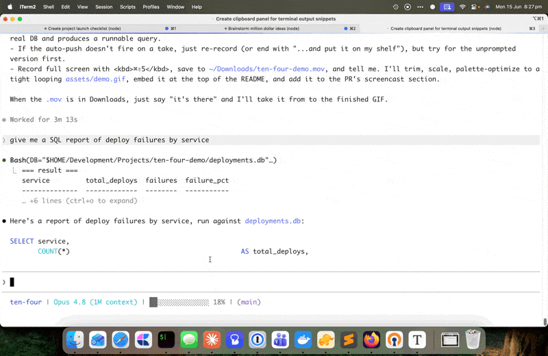

# Ten Four

**"10-4, copy that."** A shelf of clean, copyable snippets, pushed from your
terminal or from **Claude Code**, browsed and copied from **Raycast**.

When a tool prints something you want to copy (a URL, an API key, a command, a
code block), copying it straight out of the terminal gives you mangled line
breaks and stray indentation, because you're selecting reflowed text off the
character grid. Ten Four fixes the root cause: snippets travel as **data**, never
as rendered terminal text. You copy them out of Raycast with the exact bytes
intended, with no wrapping and no leading spaces.

<a href="https://www.raycast.com/jaymcc/ten-four">
  
</a>

> The button above works once the extension is approved on the Raycast Store.
> Until then, install from source (below).

## Demo

Claude Code answers a question and pushes the SQL query onto the shelf on its
own. You grab it from Raycast and paste it, clean, into your SQL console.



## How it works

```
your terminal / Claude Code  ──tenfour──▶  shelf service (/shelf)  ──▶  Raycast "Ten Four"
                              (TENFOUR_URL)   tailnet, owns the store     (Shelf URL pref)
```

The shelf is a small HTTP service (see [`server/`](server/README.md)) that owns
the store. Run it on any always-on host on your network, expose `/shelf` over
your tailnet with `tailscale serve`, then point `TENFOUR_URL` (CLI) and the
extension's **Shelf URL** preference at it. Snippets still travel as data, so you
copy them out of Raycast with pristine formatting.
- **Ten Four (Raycast extension)**: a searchable list of your snippets. Hit your
  Raycast hotkey, type a letter or two, press <kbd>↵</kbd> to copy (or
  <kbd>⌘</kbd> to paste into the front app).

## Install

### Option A: Raycast Store (one click, once approved)

Click **Add to Raycast** above, or search "Ten Four" in the Raycast Store. Then
run the **Install Ten Four CLI** command to add the `tenfour` writer.

### Option B: From source (works today)

Requires [Node.js](https://nodejs.org) and the [Raycast](https://raycast.com)
app.

```sh
git clone https://github.com/berwickgeek/ten-four.git
cd ten-four
npm ci
npm run dev
```

`npm run dev` builds the extension and registers it in Raycast immediately. It
**stays installed even after you stop the dev server** (Raycast keeps its own
compiled copy), so you only need to run this once. You can then close the
terminal.

Then install the CLI either way:

- In Raycast, open **Install Ten Four CLI** and click **Install CLI**, or
- From the repo: `./install.sh` (symlinks `assets/tenfour` into your `PATH`).

## Usage

```sh
tenfour "https://my-app.up.railway.app"          # label = first line
tenfour --label "API key" "sk-live-…"            # explicit label
printf 'def hi():\n    return 1\n' | tenfour -l "snippet" -   # multiline via stdin
tenfour list                                     # print the shelf
tenfour clear                                    # empty the shelf
```

Then summon Raycast → **Ten Four Shelf** → copy.

## Use with Claude Code

The reliable way is a **sentinel marker** plus a `Stop` hook: Claude wraps any
snippet in an invisible HTML comment, and the hook scrapes it onto the shelf
automatically, so it cannot be forgotten the way a manual CLI call can.

Add this to your `CLAUDE.md`:

```md
When you output a snippet I'm likely to want to copy (a URL, token, command,
path, or code block), wrap it in a sentinel marker:

  <!--shelf:Short Label-->
  ... the exact text ...
  <!--/shelf-->

The markers render as nothing in the terminal, so I still see a clean snippet.
```

Then wire the hook in `~/.claude/settings.json` so it fires on every turn:

```json
{
  "hooks": {
    "Stop": [{ "hooks": [{ "type": "command", "command": "~/.claude/hooks/shelf-push.sh" }] }]
  }
}
```

The hook scans each assistant message for `<!--shelf:…-->` blocks, strips any
code fence, and pushes the contents via `tenfour`. It dedups by content hash, so
re-fires never double-push.

For scripts and one-offs where the marker can't reach, call the CLI directly:

```sh
tenfour --label "<short label>" "<the exact text>"
```

Don't do both for the same snippet: a manual push bypasses the hook's hash log
and double-pushes.

## Configuration

- **CLI endpoint:** set `TENFOUR_URL` to your shelf service URL (e.g.
  `https://<your-host>.ts.net/shelf`). The CLI errors when this is unset.
- **Extension endpoint:** set the **Shelf URL** preference in Raycast to the same
  URL.
- **Service storage:** the service stores snippets at `~/.ten-four.json` on the
  server host (override with `TENFOUR_FILE`). It listens on port 7801 (override
  with `PORT`). See [`server/README.md`](server/README.md) for setup.
- The shelf keeps the most recent 200 snippets; pinned snippets are never
  trimmed.

## Notes

- The CLI is Node.js (zero dependencies) so it can ship as a single file inside
  the extension. It requires `node` on your `PATH`. A future Go rewrite would
  allow a dependency-free Homebrew bottle.

## License

MIT
